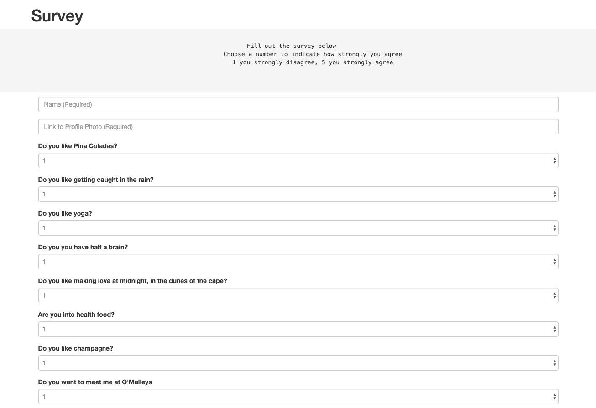

# friendFinder

<h2> <a href="https://limitless-temple-91834.herokuapp.com/survey">Find your friend match</a></h2>
&nbsp;
<h2>How it works</h2>

The friend finder takes user input in the form of a survey. Upon submitting, your answers are compared with indiviuals already in the app. A modal is then displayed with your best match.

<h3>This project was built with:</h3>
<ul>
    <li>JavaScript</li>
    <li>jQuery</li>
    <li>CSS</li>
    <li>HTML</li>
    <li>Express</li>
    <li>Hosted on Heroku</li>
</ul>
<!-- https://limitless-temple-91834.herokuapp.com/survey -->